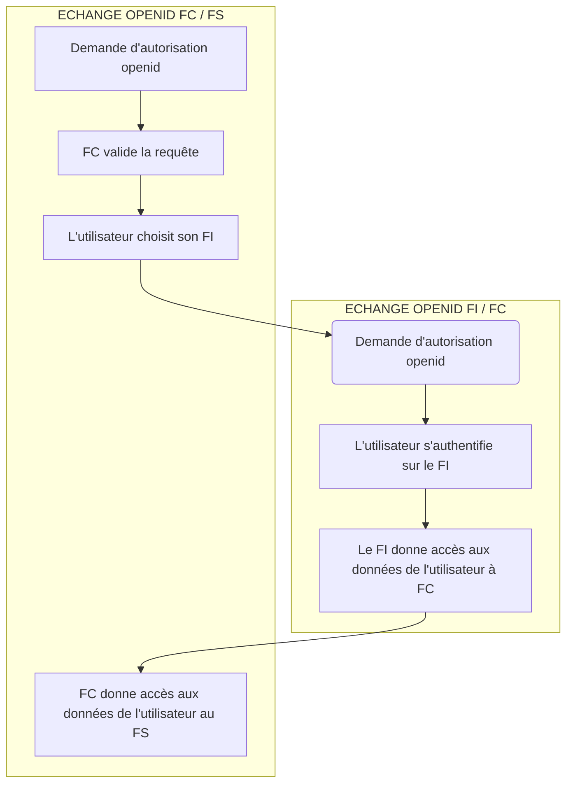

# FC Documentation

D'un point de vue technique. La cinématique FC est divisée en deux parties principales distinctes:

1. Un échange openid entre le FI et FC
2. Un échange openid entre FC et le FS

Ces deux échanges ne sont cependant pas linéaires:

1. Le FS effectue une [demande d'autorisation openid](https://openid.net/specs/openid-connect-core-1_0.html#AuthorizationEndpoint) sur le endpoint prévu à cet effet sur FC. **# Début de l'échange entre le FC et le FS**
2. FC valide que la requête est acceptable et affiche la liste des FI disponibles.
3. L'utilisateur choisit son FI puis FC effectue une [demande d'autorisation openid](https://openid.net/specs/openid-connect-core-1_0.html#AuthorizationEndpoint) sur le endpoint prévu à cet effet sur le FI. **# Début de l'échange entre le FI et FC**
4. L'utilisateur s'authentifie sur le FI.
5. Le FI donne accès aux données de l'utilisateur à FC. **# Fin de l'échange entre le FI et FC**
6. FC donne accès aux données de l'utilisateur au FS. **# fin de l'échange entre FC et FS**

L'échange entre le FI et FC est encapsulé dans l'échange entre FC et le FS. Il faut garder en tête que cette représentation reste simplifiée car il existe en vérité d'autres étapes qui s'insèrent entre ces étapes. On garde cependant une bonne vision globale de ce qu'il se passe.

## Schema de parcours utilisateur FC+ et FC low

Voir [Cinématique pour un utilisateur FC+](https://gitlab.dev-franceconnect.fr/france-connect/documentation/-/wikis/Cin%C3%A9matique-FranceConnect-).

# Dépendances

## Sécurité des dépendances

_:warning: Les actions/contournements effectuées doivent régulièrement être mises à jour en fonction de l'évolution des dépendances_

Cette section reprend des rapports de checkmarx et yarn audit.

Elle indique les contres mesures qui ont dû être prises pour palier au problème remonté.

[Sécurité des dépendances](./dépendances/sécurité/README.md).

# Codes erreurs des applications

Cette section fait le lien avec les codes erreurs des applications.

Voir [erreurs](./erreurs.md).
