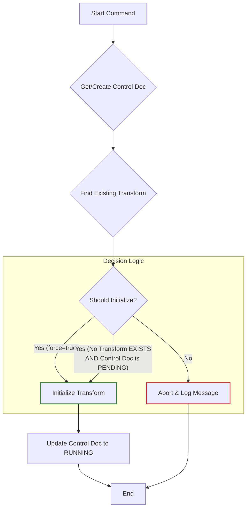
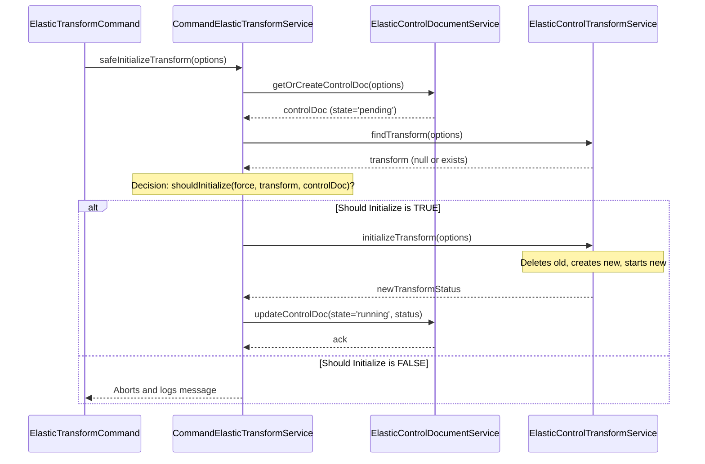
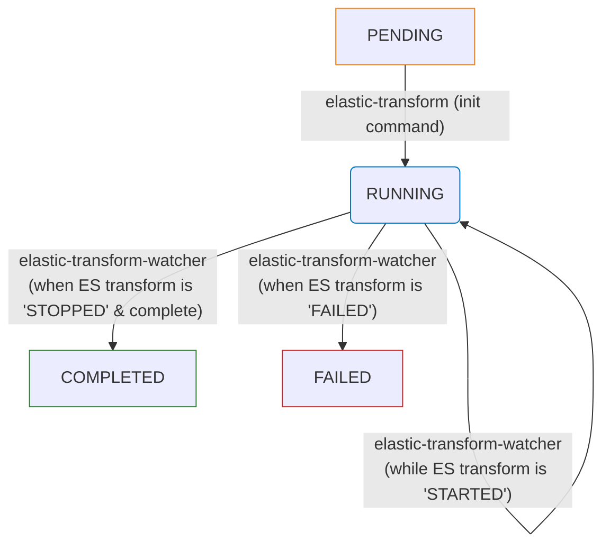

# CLI Command: `elastic-transform`

This command is the entry point for creating and starting an Elasticsearch data aggregation transform. It's designed to be safe, idempotent, and restartable.

---

## 🎯 Core Purpose

The `elastic-transform.command` orchestrates the creation of a specific Elasticsearch transform based on a set of business parameters (`product`, `range`, `pivot`, `period`). It acts as a high-level "safe initializer" that uses the underlying services from the `@fc/elasticsearch` library to perform its actions.

Its main goal is to ensure that running the same command multiple times is predictable and non-destructive.

---

## 🧠 Idempotency and Safety Logic

To prevent accidental data loss or the overwriting of an existing transform, the command follows a strict execution and decision-making flow. This logic is orchestrated by the `CommandElasticTransformService`.

1.  **State Tracking**: Before taking any action, the command creates (or finds) a **control document** in Elasticsearch. This document acts as a permanent record of the command's execution state for the given parameters.

2.  **Pre-flight Checks**: The command then checks two things:
    - Does a transform with the same deterministic ID already exist in Elasticsearch?
    - What is the `state` of the control document (`pending`, `running`, etc.)?

3.  **Decision Gate**: Based on these checks, it decides whether to proceed. The command will **only** initialize the transform if one of the following conditions is met:
    - The `--force` flag is used. This bypasses all safety checks and acts as a "reset" button.
    - **OR** no transform currently exists **AND** the control document's state is `pending`. This is the standard "first run" scenario.

If neither of these conditions is true (e.g., a transform already exists and you didn't specify `--force`), the command will safely abort with a message, preventing any changes.

<details><summary>Visualization</summary>



</details>

---

## ⚙️ Usage and Options

The command is executed from your terminal.

```bash
node dist/apps/command-elastic/main.js elastic-transform [options]
```

### Options

| Flag(s)               | Description                                                                                            | Required | Default            |
| --------------------- | ------------------------------------------------------------------------------------------------------ | -------- | ------------------ |
| `--product <product>` | **Product.** Specifies the dataset to analyze. One of: `franceconnect`, `franceconnect_plus`.          | Yes      | N/A                |
| `--range <range>`     | **Range.** The time aggregation window. One of: `month`, `semester`, `year`.                           | Yes      | N/A                |
| `--pivot <pivot>`     | **Pivot.** The field to group by. One of: `sp` (Service Provider), `idp` (Identity Provider).          | Yes      | N/A                |
| `--period <period>`   | **Period.** The target period in `YYYY-MM` format. It sets the last month of the desired range.        | No       | The previous month |
| `-d, --dry-run`       | Don't perform any write operations. Logs the actions that would be taken.                              | No       | `false`            |
| `-f, --force`         | Force recreation. Deletes and recreates the transform and its destination index if they already exist. | No       | `false`            |

---

### 📝 Examples

**1. Standard run for the previous month**

This command creates a transform for the `franceconnect_plus` product, grouped by `sp`, for last month's data (default period is last month).

```bash
node dist/apps/command-elastic/main.js elastic-transform \
  --product franceconnect_plus \
  --range month \
  --pivot sp
```

**2. Run for a longer period**

This command targets the semester ending on the 31st of July (the end of the period)

```bash
node dist/apps/command-elastic/main.js elastic-transform \
  --product franceconnect_plus \
  --range semester \
  --pivot sp \
  --period 2025-07
```

**3. Previewing actions with `--dry-run`**

This command will not touch Elasticsearch. Instead, it will log all the steps it would have taken, such as which transform it would delete and create.

```bash
node dist/apps/command-elastic/main.js elastic-transform \
  --product franceconnect_plus \
  --range month \
  --pivot sp \
  --dry-run
```

**4. Forcing a reset of an existing transform**

If a transform for July 2025 already exists but you need to recreate it from scratch, use the `--force` flag.

```bash
node dist/apps/command-elastic/main.js elastic-transform \
  --product franceconnect_plus \
  --range month \
  --pivot sp \
  --period 2025-07 \
  --force
```

---

## 🔄 Execution Flow

The following diagram illustrates how the command and its service interact with the underlying library modules to perform the initialization.

<details><summary>Visualization</summary>



</details>

---

# CLI Command: `elastic-transform-watcher`

This command is the second half of the transform lifecycle, designed to be run periodically (e.g., via a cron job).

---

## 🎯 Core Purpose

After the `elastic-transform.command` command **initializes** a job and sets its control document state to `RUNNING`, it finishes immediately. The Elasticsearch transform itself continues to run in the background, which may take seconds, minutes, or hours.

The `elastic-transform-watcher.command` closes the loop. It is a "state synchronizer" : its sole purpose is to check the live status of an active Elasticsearch transform (initialized by the `elastic-transform.command`) and update that job's corresponding **control document** to its final state (`COMPLETED` or `FAILED`).

---

## 🔄 The Transform Lifecycle & Watcher Logic

This command orchestrates a "read-and-update" flow, managed by the `CommandElasticTransformService`.

1.  **Find Job**: Using the exact same business parameters (`product`, `range`, `pivot`, `period`) as the initialization command, the watcher locates two things:
    1.  The **Control Document** (using its deterministic SHA-256 hash ID).
    2.  The **Live Transform Status** from Elasticsearch (using its deterministic human-readable ID).

2.  **Pre-flight Check**: The command performs a critical decision check. It will **only** proceed if:
    - the Control Document's state is exactly `RUNNING`.

3.  **Abort Condition**: If the control document is _not_ `RUNNING` (e.g., it's already `COMPLETED`, `FAILED`, or still `PENDING`), the watcher aborts immediately. This makes it safe to run multiple times, as it knows its job is already done or hasn't started yet.

4.  **State Synchronization**: If the check passes, the watcher determines the correct final state:
    - If the live transform state is `STARTED` (still running): The watcher updates the control doc state back to `RUNNING` (effectively a "heartbeat").
    - If the live transform state is `STOPPED` AND its checkpoint is greater than zero (meaning it finished): The watcher updates the control doc state to **`COMPLETED`**.
    - If the live transform state is `FAILED` (or `STOPPED` before finishing, or **not found**): The watcher updates the control doc state to **`FAILED`**.

This flow is visualized below, showing how this command moves the state _out_ of the `RUNNING` status set by the `elastic-transform` command.

<details><summary>Visualization</summary>



</details>

---

## ⚙️ Usage and Options

The command is executed from your terminal.

```bash
node dist/apps/command-elastic/main.js elastic-transform-watcher [options]
```

### Options

| Flag(s)               | Description                                                                                   | Required | Default            |
| --------------------- | --------------------------------------------------------------------------------------------- | -------- | ------------------ |
| `--product <product>` | **Product.** Specifies the dataset to analyze. One of: `franceconnect`, `franceconnect_plus`. | Yes      | N/A                |
| `--range <range>`     | **Range.** The time aggregation window. One of: `month`, `semester`, `year`.                  | Yes      | N/A                |
| `--pivot <pivot>`     | **Pivot.** The field to group by. One of: `sp` (Service Provider), `idp` (Identity Provider). | Yes      | N/A                |
| `--period <period>`   | **Period.** The target period in `YYYY-MM` format.                                            | No       | The previous month |
| `-d, --dry-run`       | Don't perform any write operations. Logs the state transition that would be taken.            | No       | `false`            |

---

### 📝 Examples

**1. Checking the status of last month's default run**

This command checks the transform for `franceconnect_plus`, grouped by `sp`, for the previous month (default period is last month).

```bash
node dist/apps/command-elastic/main.js elastic-transform-watcher \
  --product franceconnect_plus \
  --range month \
  --pivot sp
```

**2. Checking the status of a specific historical transform**

This command the semester ending on the 31st of July (the end of the period).

```bash
node dist/apps/command-elastic/main.js elastic-transform-watcher \
  --product franceconnect_plus \
  --range semester \
  --pivot sp \
  --period 2025-07
```

**3. Previewing the state synchronization**

Using `--dry-run`, this command will connect to Elasticsearch to read both the control doc and transform status, but it will only log the state update it _would_ have performed (e.g., "Would update control doc state from RUNNING to COMPLETED").

```bash
node dist/apps/command-elastic/main.js elastic-transform-watcher \
  --product franceconnect_plus \
  --range month \
  --pivot sp \
  --dry-run
```
