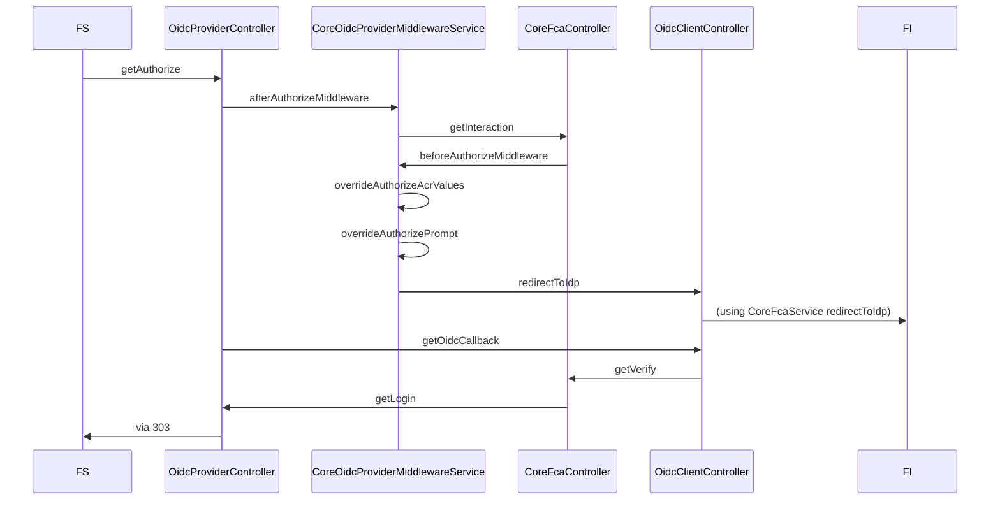

# AgentConnect Core

Application "core" d'AgentConnect, il s'agit de l'application proposée aux agents de l'Etat pour se connecter à un fournisseur de service (SP) partenaire grâce à un fournisseur d'identité (IdP) partenaire.

## Gestion des subject identifiers ou "sub"

Les _sub_ sont des identifiants unique au sein de l'application (voir [la documentation openid](https://openid.net/specs/openid-connect-core-1_0.html#SubjectIDTypes) pour référence).

L'application fonctionne sur le mode `pairwise`, c'est à dire que le _sub_ généré lors d'une interaction est propre au couple usager / fournisseur de service.  
Contrairement au mode `public`, dans lequel le _sub_ est propre à l'usager mais reste identique quel que soit le fournisseur de service.

La génération du sub est effectuée lors de la vérification de l'identité reçue d'un Fournisseur d'identité, l'aspect cryptographique est délégué à la librairie [@fc/cryptography](../../libs/cryptography) et prend en paramètre l'`identityHash` (hash de l'identité de l'usager) et l'identifiant unique de fournisseur de service.

Le _sub_ est supposé permettre l'identification d'une identité dans la durée et doit donc être stable. Cependant il existe des situations susceptibles de faire changer le _sub_ .

- Changements d'état civil dans le RNIPP (on parle ici de changements rares tels qu'un changement de nom, de genre ou encore une correction de date de naissance)
- Changement du sel de hashage de l'`identityHash` (un tel changement modifierait tous les subs et est donc improbable)

## Gestion des vérifications business

Dans le service de core-fca `core-fca.service.ts` est définie une fonction `verify`.

Cette fonction sert à effectuer toutes les vérifications métier de l'application:

- Lorsque l'utilisateur vient de se connecter et avant de rediriger vers le FS
- Lorsque l'utilisateur possède une session active (SSO) et avant de rediriger vers le FS

La vérification à cet endroit permet de s'assurer dans tous les cas que le business est traité à un et un seul endroit.

Pour des raisons UX, certaines vérifications métiers peuvent avoir été faites plus tôt, mais c'est cet appel qui reste le "dernier rempart" et qui fait donc foi.

Si le FI utilisé n'est pas compatible avec le FS (blacklist/whitelist), alors l'utilisateur est renvoyé vers la page de sélection du FI (`/interaction`).

## Architecture globale

## Restriction des fqdns par FI

Actuellement, l'user peut entrer une adresse email dans la mire PCI puis en changer dans certains FIs.
Nous allons bientôt ajouter un contrôle qui force à utiliser sur le FI le même fqdn que celui transmis à PC.

Les règles d'acception sont détaillés dans le schéma ci-dessous:

```mermaid
flowchart TD
  fqdnIsAllowedForIdp[Is fqdn allowed?]
  fqdnIsAllowedForIdp-->HasFqdnIdp

  HasFqdnIdp["Fqdn has connected idp(s)?"]
  FqdnHasIdp["Fqdn has idp(s)"]
  FqdnHasNoIdp[Fqdn has no idp]
  HasFqdnIdp-->FqdnHasIdp
  HasFqdnIdp-->FqdnHasNoIdp

  FqdnMatchesIdp[Fqdn matches 1 idp]
  FqdnMatchesNoIdp[Fqdn doesn't match 1 idp]
  FqdnHasIdp-->FqdnMatchesIdp
  FqdnHasIdp-->FqdnMatchesNoIdp

  IsAllowed[Allowed]
  IsNotAllowed["Not allowed
  (could have been a problem
  with regions fqdns
  using mcp
  but now all regions fqdns
  are connected with mcp idp)"]

  FqdnMatchesIdp-->IsAllowed
  FqdnMatchesNoIdp-->IsNotAllowed

  IsDefaultIdpActivated[Has default idp?]
  DefaultIdpActivated[Default idp activated]
  DefaultIdpNotActivated[Default idp not activated]

  FqdnHasNoIdp-->IsDefaultIdpActivated
  IsDefaultIdpActivated-->DefaultIdpActivated
  IsDefaultIdpActivated-->DefaultIdpNotActivated

  NoIdpNoDefaultNotAllowed["Not allowed
  (e.g. on rie all idps
  are associated to one or
  more fqdns
  if a fqdn has no idp
  connected and there is no
  default idp
  this fqdn doesn't
  permit to connect)"]

  DefaultIdpNotActivated-->NoIdpNoDefaultNotAllowed

  IsThisDefaultIdp[Idp is default Idp?]

  DefaultIdpActivated-->IsThisDefaultIdp
  ThisIsDefaultIdp["Idp is default idp"]
  ThisIsNotDefaultIdp["Idp isn't default idp"]
  IsThisDefaultIdp-->ThisIsDefaultIdp
  IsThisDefaultIdp-->ThisIsNotDefaultIdp

  IsAllowed2[Allowed]
  ThisIsDefaultIdp-->IsAllowed2

  IsNotAllowed2[Not allowed]
  ThisIsNotDefaultIdp-->IsNotAllowed2

```

En résumé:

- Lorsque le fqdn de l'email retourné par le FI est lié à une ou plusieurs configurations FqdnToProvider elles-mêmes liées à un ou plusieurs FI, nous vérifions que le FI utilisé correspond bien au fqdn. Si ce n'est pas le cas, la connexion n'est pas autorisée.
- Lorsque le fqdn récupéré n'est lié à aucun FI, il n'est utilisable qu'avec le FI par défaut. Nous vérifions donc que la feature de FI par défaut est bien activée et que le FI utilisé est bien le FI par défaut, si ce n'est pas le cas, la connexion n'est pas autorisée.

Pour l'instant, les connexions non autorisées ne sont pas bloquées mais seulement logguées.
