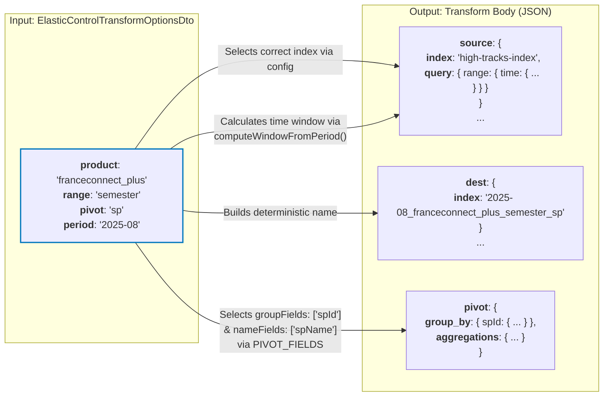
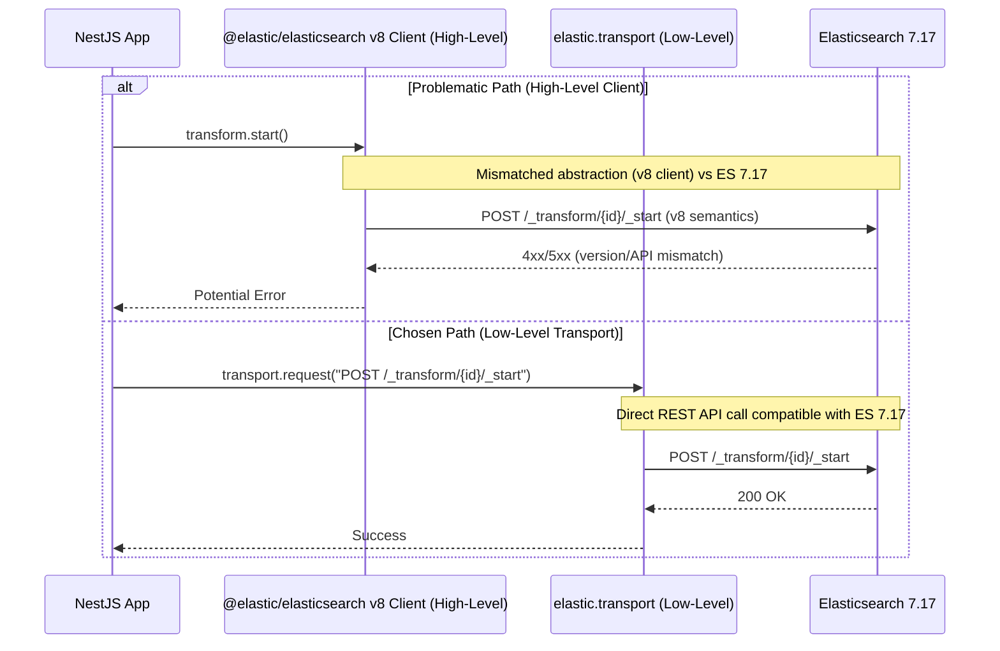

# 📦 ElasticControlTransformService

This service acts as a high-level orchestrator for managing the lifecycle of Elasticsearch transforms. It translates business-logic options into concrete transform configurations and operations, ensuring idempotent and safe execution.

---

## 🧠 Core Logic & Responsibilities

1.  **Translating Business Options**: It accepts a strongly-typed `ElasticControlTransformOptionsDto` (`product`, `range`, `pivot`, `period`) as its input.
2.  **Deterministic ID Generation**: It creates unique, predictable IDs for transforms and their destination indices based on the input options.
3.  **Dynamic Body Construction**: It dynamically builds the complex query and aggregation body for the transform.
4.  **Lifecycle Orchestration**: It manages the full lifecycle (delete, create, start) of a transform to ensure idempotency.

---

## 🆔 Deterministic ID Generation

A core concept of this service is its ability to generate a consistent identifier for a transform based on its configuration options. The private `buildTransformId` method sorts the option values alphabetically and joins them.

**Example:**

- **Options**: `{ product: 'franceconnect', pivot: 'sp', range: 'month', period: '2025-08' }`
- **Sorted Values**: `['2025-08', 'franceconnect', 'month', 'sp']`
- **Resulting ID**: `2025-08_franceconnect_month_sp`

---

## 🔄 Lifecycle Management & Idempotency

The main entry point for creating or resetting a transform is the `initializeTransform` method. It follows a strict sequence of operations to guarantee that running a command multiple times with the same parameters yields the exact same clean state.

The orchestration sequence is:

1.  **`safeDeleteTransform`**: The service first attempts to gracefully stop and delete any existing transform with the same deterministic ID. This is "safe" because it **ignores "not found" (404) errors**, preventing crashes if the transform doesn't exist yet.
2.  **`destIndex.safeDeleteDestIndex`**: It then delegates to the `ElasticControlDestIndexService` to perform the same safe deletion for the transform's destination index, ensuring no old data remains.
3.  **`createTransform`**: It builds the new transform body and sends the creation request to Elasticsearch.
4.  **`startTransform`**: Finally, it kicks off the new transform job.

---

## 🏗️ Dynamic Transform Body Construction

The `buildTransformBody` method is the factory for the transform's configuration. It assembles the JSON body sent to Elasticsearch based on the `ElasticControlTransformOptionsDto`.

- **`source.index`**: The source data index is selected from the application configuration based on the `product` option (`franceconnect` or `franceconnect_plus`).
- **`source.query`**: A static time range query is constructed. The `gte` (greater-than-or-equal) and `lt` (less-than) dates are dynamically calculated by the `computeWindowFromPeriod` utility based on the `period` and `range` options. For example, a `period` of `2025-08` and a `range` of `semester` would set a window from the start of March 2025 to the end of August 2025.
- **`dest.index`**: The destination index is also built deterministically from the input options.
- **`pivot.group_by` & `aggregations`**: The fields used for grouping and aggregation are chosen based on the `pivot` option. The `PIVOT_FIELDS` constant defines `groupFields` and `nameFields` as arrays to support both single-field and multi-field pivots consistently:
  - If `pivot: 'sp'`, it will group by `spId` (from `groupFields: ['spId']`) and use `spName` (from `nameFields: ['spName']`).
  - If `pivot: 'idp'`, it will group by `idpId` (from `groupFields: ['idpId']`) and use `idpName` (from `nameFields: ['idpName']`).
  - If `pivot: 'idp_public_sp'`, it will group by `idpId`, use `idpName`, and filter only connections to public service providers (`spType: 'public'`).
  - If `pivot: 'idp_private_sp'`, it will group by `idpId`, use `idpName`, and filter only connections to private service providers (`spType: 'private'`).
  - If `pivot: 'sp_idp_pair'`, it will group by **both** `spId` AND `idpId` (from `groupFields: ['spId', 'idpId']`), using both `spName` and `idpName` (from `nameFields: ['spName', 'idpName']`). This creates metrics for every unique (SP, IDP) combination, allowing analysis of relationships between Service Providers and Identity Providers. **Note:** This produces significantly more documents than single-field pivots (cartesian product of SPs × IDPs with actual connections).

Visualization

---

## 🧪 Dry Run Mode

All state-changing methods (`initializeTransform`, `createTransform`, etc.) support a `dryRun: boolean` flag. When `dryRun` is **true**, the service **bypasses all calls to Elasticsearch**. Instead, it logs the actions it _would_ have taken to the console.

This is a critical safety feature for a CLI application, allowing users to preview the effects of a command without altering any data.

---

## ⚙️ API Reference

#### The `TransformStatusInterface`

This interface serves as the **standardized, simplified representation of a transform's state** used throughout our application. It flattens the complex, nested response from Elasticsearch into a clean, easy-to-use object.

- `id: string`
  - **Meaning**: The unique, deterministic ID of the transform.
  - **Origin**: Generated by `buildTransformId(options)`.
- `state: TransformStatesEnum`
  - **Meaning**: The current lifecycle state of the job (`started`, `stopped` or `failed`).
  - **Origin**: Extracted directly from the `transforms[0].state` field in the Elasticsearch stats response.
- `lastCheckpoint?: number`
  - **Meaning**: A timestamp indicating the last point in time the transform has processed. This is crucial for understanding its progress.
  - **Origin**: Safely extracted from the nested `transforms[0].checkpointing.last.checkpoint` field by the `getTransformLastCheckpoint` utility.
- `docsIndexed?: number`
  - **Meaning**: The total number of documents that have been created in the destination index.
  - **Origin**: Safely extracted from `transforms[0].stats.documents_indexed` by the `getTransformDocIndexed` utility.
- `reason?: string`
  - **Meaning**: If the transform `state` is `failed`, this field contains the reason for the failure.
  - **Origin**: Extracted from the `transforms[0].reason` field.

#### findTransform

- **Description**: Checks for the existence and status of a transform based on the given options. It builds the deterministic ID and queries the `_transform/_stats` endpoint.
- **Signature**: `findTransform(options: ElasticControlTransformOptionsDto): Promise<TransformStatusInterface | null>`
- **Returns**:
  - An object conforming to the `TransformStatusInterface` (`{ id, state, lastCheckpoint, ... }`) if the transform is found.
  - `null` if no transform with that ID exists.

#### initializeTransform

- **Description**: The main orchestration method that executes the full, idempotent lifecycle: safely deleting any pre-existing transform and index, then creating and starting a new one.
- **Signature**: `initializeTransform(options: ElasticControlTransformOptionsDto, dryRun: boolean): Promise<TransformStatusInterface>`
- **Returns**: A `TransformStatusInterface` object confirming the newly created transform's ID and its initial `STARTED` state.

---

# 📦 ElasticControlDocumentService

This service is responsible for creating and managing **control documents** within a dedicated Elasticsearch index. It acts as a state machine and audit log, tracking the status of operations (like initializing a transform) to ensure they are **idempotent and restartable**.

---

## 🧠 Core Logic & Responsibilities

1.  **Operation Tracking**: It creates a unique document for each command execution, storing the command's input options and its current state (e.g., `pending`, `running`, `completed`).
2.  **State Management**: It provides methods to fetch a command's document and update its state as the operation progresses.
3.  **Idempotency & Restartability**: By checking for an existing control document, a higher-level process can determine if an operation has already been completed, is in progress, or needs to be started from scratch.
4.  **Deterministic Hashed ID Generation**: It generates a unique, predictable, and fixed-length ID for each control document based on the operation type and its specific parameters.
5.  **Automatic Index Provisioning**: The service is self-contained; it automatically creates and configures its required control index on first use.

---

## 🔑 Deterministic Hashed ID Generation

A core feature of this service is its ability to generate a consistent, unique identifier for any given operation. Unlike the human-readable ID in the `ElasticControlTransformService`, this service uses a **cryptographic hash** to ensure a uniform and secure identifier.

The private `buildControlDocId` method follows these steps:

1.  It takes the `operation` name (from `ElasticOperationsEnum`, e.g., `transform`) and the `options` DTO.
2.  It sorts the option values alphabetically to ensure consistency regardless of key order.
3.  It joins the operation and the sorted values into a single string with a `.` delimiter.
4.  It computes the **SHA-256 hash** of this string to produce a fixed-length hexadecimal ID.

**Example:**

- **Operation**: `ElasticOperationsEnum.TRANSFORM` (`'transform'`)
- **Options**: `{ product: 'franceconnect', pivot: 'sp', range: 'month', period: '2025-08' }`
- **Sorted Payload**: `transform.2025-08.franceconnect.month.sp`
- **Resulting Hashed ID**: `b8e9...a1f7` (a 64-character SHA-256 hash)

---

## 🔄 The `getOrCreate` Pattern for Restartable Operations

The main entry point, `getOrCreateControlDoc` prevents duplicate work and allows a process that was interrupted to pick up where it left off:

1.  It calls `getOrCreateControlDoc` with the operation's parameters.
2.  The service builds the deterministic hashed ID.
3.  It **searches** for a document with this ID.
    - **If found**, it returns the existing document.
    - **If not found**, it **creates** a new control document with the initial state of `pending` and returns it.

---

## 🏛️ Automatic Index Provisioning

The service is designed to be self-sufficient. The first time any method attempts to interact with the control index, the private `ensureControlIndex` function is triggered.

- It first checks if the configured `controlIndex` exists.
- If it exists, it does nothing.
- If it's missing, it proceeds to call `createControlIndex`. This method creates the index with a predefined, strict mapping. This mapping is optimized to treat all fields within the `options` and `status` objects as `keyword`s.

---

## 🧪 Dry Run Mode

Consistent with other services in the library, all state-changing methods (`getOrCreateControlDoc`, `updateControlDoc`) support a `dryRun: boolean` flag. When `dryRun` is **true**, the service **bypasses all write calls to Elasticsearch** (e.g., creating the index, creating a document, updating a document). Instead, it logs the actions it _would_ have taken, providing a safe way to preview a command's execution plan.

---

## ⚙️ API Reference

#### The `ControlDocumentInterface`

This interface defines the structure of the state-tracking documents stored in the control index.

- `id: string`: The unique, deterministic SHA-256 hash of the operation.
- `operation: ElasticOperationsEnum`: The type of operation being tracked (e.g., `transform`).
- `state: ControlStatesEnum`: The current lifecycle state of the operation (`pending`, `running`, `completed`, `failed`).
- `createdAt: string`: ISO timestamp of when the document was first created.
- `updatedAt: string`: ISO timestamp of the last modification.
- `options: ElasticControlTransformOptionsDto`: A copy of the input parameters that initiated the operation.
- `status?: Record<string, unknown>`: An optional object to store detailed results or status information from the operation (e.g., the nb of doc indexed by a transform).

#### getOrCreateControlDoc

- **Description**: The primary method for idempotently getting or creating a control document. It's the starting point for any tracked operation.
- **Signature**: `getOrCreateControlDoc(options: ElasticControlTransformOptionsDto, operation: ElasticOperationsEnum, dryRun: boolean): Promise<ControlDocumentInterface>`
- **Returns**: The existing control document if found, or a newly created one with a `pending` state.

#### updateControlDoc

- **Description**: Updates the state and status of an existing control document. This is used to mark an operation as `completed` or `failed` as it progresses.
- **Signature**: `updateControlDoc(doc: ControlDocumentInterface, nextState: ControlStatesEnum, status: Record<string, unknown>, dryRun: boolean): Promise<void>`

#### getControlDocById

- **Description**: Retrieves a single control document by its unique hashed ID.
- **Signature**: `getControlDocById(id: string): Promise<ControlDocumentInterface | null>`
- **Returns**: The document's source if found, otherwise `null`.

#### buildControlDocId

- **Description**: The public utility function that generates the deterministic SHA-256 hash for an operation.
- **Signature**: `buildControlDocId(operation: ElasticOperationsEnum, options: ElasticControlTransformOptionsDto): string`

---

# 📦 ElasticControlClientService

A low-level, injectable NestJS service that acts as a dedicated wrapper for interacting with the Elasticsearch REST API. It provides version-agnostic methods for managing indices, documents, and transforms.

A crucial design choice in this service is the **exclusive use of the low-level `elastic.transport.request` method** instead of the high-level, built-in methods provided by `@nestjs/elasticsearch` (e.g., `this.elastic.index(...)`, `this.elastic.search(...)`).

### Version Mismatch Risk ⚠️

This application interacts with a production Elasticsearch cluster running version **`7.17`**. However, the project's `@nestjs/elasticsearch` dependency is at version **`^11.0.0`**, which itself relies on a much more recent version of the official `@elastic/elasticsearch` client.

This version gap creates a high risk of incompatibility (**API Drift**): high-level methods in the modern client library may have different function signatures, expect different request body structures, or interpret responses differently than what the older ES `7.17` server supports.

### Direct API Control 🔌

By using `elastic.transport.request`, we bypass the client's high-level abstractions and communicate directly with the Elasticsearch REST API. This approach offers several key advantages:

1.  **Version Independence:** Our service is coupled to the stable Elasticsearch REST API specification for v7.17, not the implementation details of a specific client library version. This ensures our requests are always correctly formatted for our target server.
2.  **Explicit & Transparent:** Each method in this service maps directly to a specific REST API endpoint (e.g., `startTransform` calls `POST /_transform/{id}/_start`). This makes the code's behavior unambiguous and easy to cross-reference with the official Elasticsearch documentation.
3.  **Stability:** It guarantees that future updates to `@nestjs/elasticsearch` will not break our integration, as long as the underlying transport layer remains available.

The diagram below illustrates our chosen communication path versus the problematic high-level path.

Visualization

---

## ⚙️ API Reference

This section details each method, its purpose, its corresponding API endpoint, and any specific, opinionated options used in its implementation.

### Index Management

#### getIndex

- **Description**: Fetches the settings and mappings for a specific index. Throws an error if the index does not exist.
- **Endpoint**: `GET /{index}`

#### createIndex

- **Description**: Creates a new index with the specified configuration.
- **Endpoint**: `PUT /{index}`

#### deleteIndex

- **Description**: Deletes an existing index.
- **Endpoint**: `DELETE /{index}`

---

### Transform Management

#### createTransform

- **Description**: Creates a new transform job with the specified configuration.
- **Endpoint**: `PUT /_transform/{id}`

#### startTransform

- **Description**: Starts a previously created transform job.
- **Endpoint**: `POST /_transform/{id}/_start`

#### stopTransform

- **Description**: Stops a running transform job. This method is configured to be forceful and synchronous.
- **Endpoint**: `POST /_transform/{id}/_stop`
- **Opinionated Options**:
  - `force: true`: Ensures the transform stops, even if it's in a failed state or hasn't completed a checkpoint. This is vital for our state machine to reset or halt a job reliably.
  - `wait_for_completion: true`: Makes the API call block until the stop operation is fully complete. This synchronous behavior is essential for idempotent commands that need to confirm a resource is stopped before proceeding to the next step (e.g., deleting it).

#### deleteTransform

- **Description**: Deletes a transform job. The job must be stopped first.
- **Endpoint**: `DELETE /_transform/{id}`

#### getTransformStats

- **Description**: Retrieves statistics for a specific transform job, including its state and progress.
- **Endpoint**: `GET /_transform/{id}/_stats`
- **Response Type**: Returns a `Promise<ElasticTransformStatsResponse>`, which contains a `count` and an array of `transforms` with detailed statistics.

---

### Document Management

#### getDocument

- **Description**: Retrieves a single document by its ID from a specified index.
- **Endpoint**: `GET /{index}/_doc/{id}`
- **Response Type**: Returns a `Promise<ElasticDocumentResponse>`, containing the document's content in the `_source` property.

#### countDocuments

- **Description**: Gets the number of documents that match a given query.
- **Endpoint**: `POST /{index}/_count`
- **Response Type**: Returns a `Promise<ElasticCountDocumentsResponse>` which has a single `count` property.

#### createDocument

- **Description**: Creates a new document with a specific ID.
- **Endpoint**: `PUT /{index}/_doc/{id}`
- **Opinionated Options**:
  - `refresh: 'wait_for'`: This parameter forces an index refresh on the relevant shard after the operation. This makes the newly created document immediately available for searching, preventing race conditions in scripts that write and then immediately read data.

#### updateDocument

- **Description**: Updates an existing document or creates it if it doesn't exist (upsert).
- **Endpoint**: `POST /{index}/_update/{id}`
- **Opinionated Options**:
  - `doc_as_upsert: true`: A convenient option that uses the content of the `doc` field to create the document if it's missing. This simplifies create-or-update logic into a single API call.
  - `refresh: 'wait_for'`: Same as `createDocument`, this ensures data consistency for subsequent read operations.
  - `retry_on_conflict: 3`: Automatically retries the update up to 3 times if a version conflict occurs. This builds resilience against rare race conditions where multiple processes might try to update the same document simultaneously.
