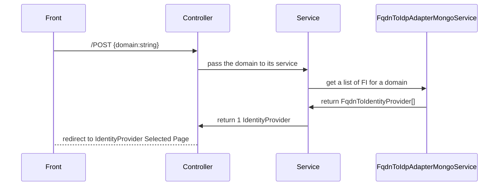

# Fully Qualified Domain Name to Identity Provider Adapter Mongo

This library is a MongoDB adapter that retrieves a list of Identity Providers (FIs) based on the email domain names of users.

## About

This library provides an adapter to retrieve the FIs stored in MongoDB based on the email domain names of users.

The library can potentially return multiple FIs for the same domain name. However, it does not choose an FI; that responsibility is left to the calling application, which is aware of whitelist/blacklist concepts.

The responsibility of this library is technical. It persists a relationship between email domain names and FIs in the "fqdnToProvider" collection and allows you to retrieve all elements of this collection through a search by email.

## Expected Workflow

In this scheme, only the "FqdnToIdpAdapterMongoService" component is in our library.