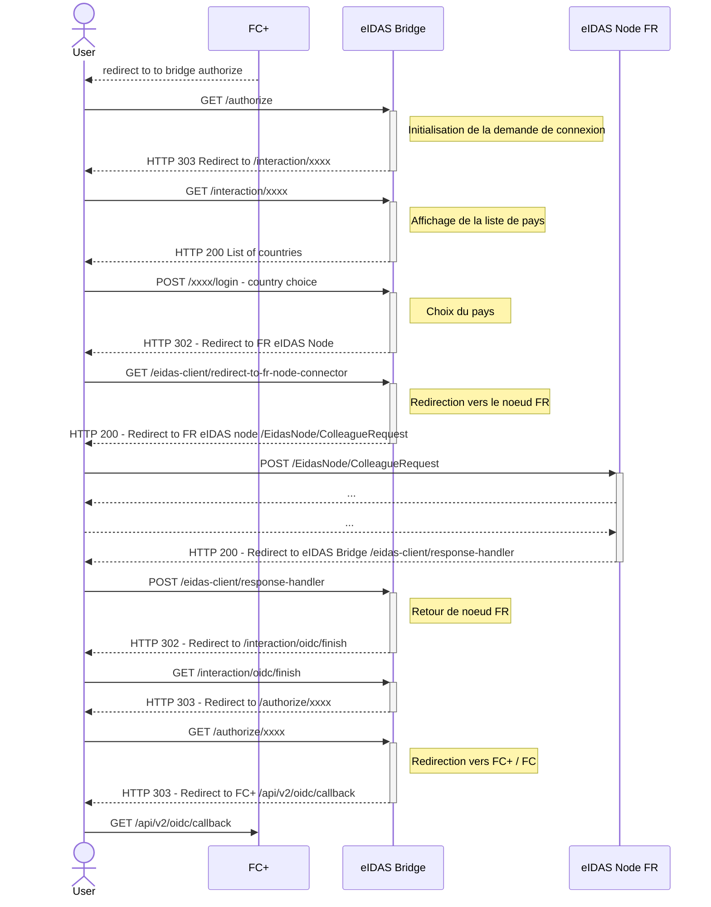

```mermaid
sequenceDiagram
    actor U as User
    participant F as FC+
    participant B as eIDAS Bridge
    participant N as eIDAS Node FR

    F-->>U: redirect to to bridge authorize
    U->>+B: GET /authorize
    Note right of B : Initialisation de la demande de connexion
    B-->>-U: HTTP 303 Redirect to /interaction/xxxx
    U->>+B: GET /interaction/xxxx
    Note right of B : Affichage de la liste de pays

    B-->>-U: HTTP 200 List of countries

    U->>+B: POST /xxxx/login - country choice
    Note right of B : Choix du pays

    B-->>-U: HTTP 302 - Redirect to FR eIDAS Node
    U->>+B: GET /eidas-client/redirect-to-fr-node-connector
    Note right of B : Redirection vers le noeud FR

    B-->>-U: HTTP 200 - Redirect to FR eIDAS node /EidasNode/ColleagueRequest


    U->>+N: POST /EidasNode/ColleagueRequest
    N-->>U: ...
    U-->>N: ...
    N-->>-U: HTTP 200 - Redirect to eIDAS Bridge /eidas-client/response-handler

    U->>+B : POST /eidas-client/response-handler
    Note right of B : Retour de noeud FR

    B-->>-U: HTTP 302 - Redirect to /interaction/oidc/finish
    U->>+B : GET /interaction/oidc/finish
    B-->>-U: HTTP 303 - Redirect to /authorize/xxxx
    U->>+B : GET /authorize/xxxx
    Note right of B : Redirection vers FC+ / FC

    B-->>-U: HTTP 303 - Redirect to FC+ /api/v2/oidc/callback

    U->>F: GET /api/v2/oidc/callback

```
