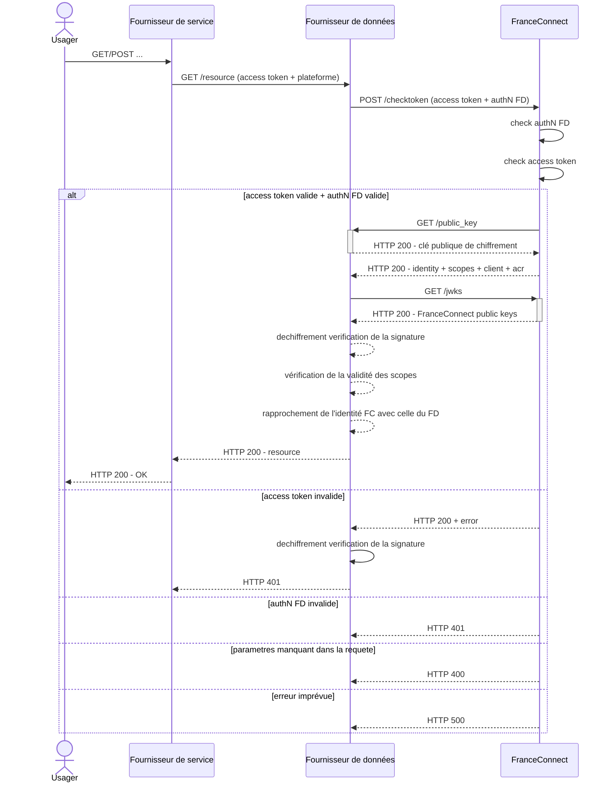

```mermaid

sequenceDiagram

    actor U as Usager
    participant FS as Fournisseur de service
    participant FD as Fournisseur de données
    participant FC as FranceConnect


    U->>FS: GET/POST ...

    FS->>FD: GET /resource (access token + plateforme)

    FD->>FC : POST /checktoken (access token + authN FD)
    FC->>FC: check authN FD
    FC->>FC: check access token

    alt access token valide + authN FD valide

        FC->>+FD : GET /public_key
        FD-->>-FC : HTTP 200 - clé publique de chiffrement

        FC-->>FD : HTTP 200 - identity + scopes + client + acr

        FD->>+FC: GET /jwks
        FC-->>-FD: HTTP 200 - FranceConnect public keys


        FD-->>FD : dechiffrement verification de la signature
        FD-->>FD : vérification de la validité des scopes
        FD-->>FD : rapprochement de l'identité FC avec celle du FD
        FD-->>FS : HTTP 200 - resource
        FS-->>U : HTTP 200 - OK

    else access token invalide

      FC-->>FD : HTTP 200 + error
      FD->>FD : dechiffrement verification de la signature
      FD-->>FS : HTTP 401

   else authN FD invalide

      FC-->>FD : HTTP 401

   else parametres manquant dans la requete

      FC-->>FD : HTTP 400

   else erreur imprévue

      FC-->>FD : HTTP 500

    end

```
