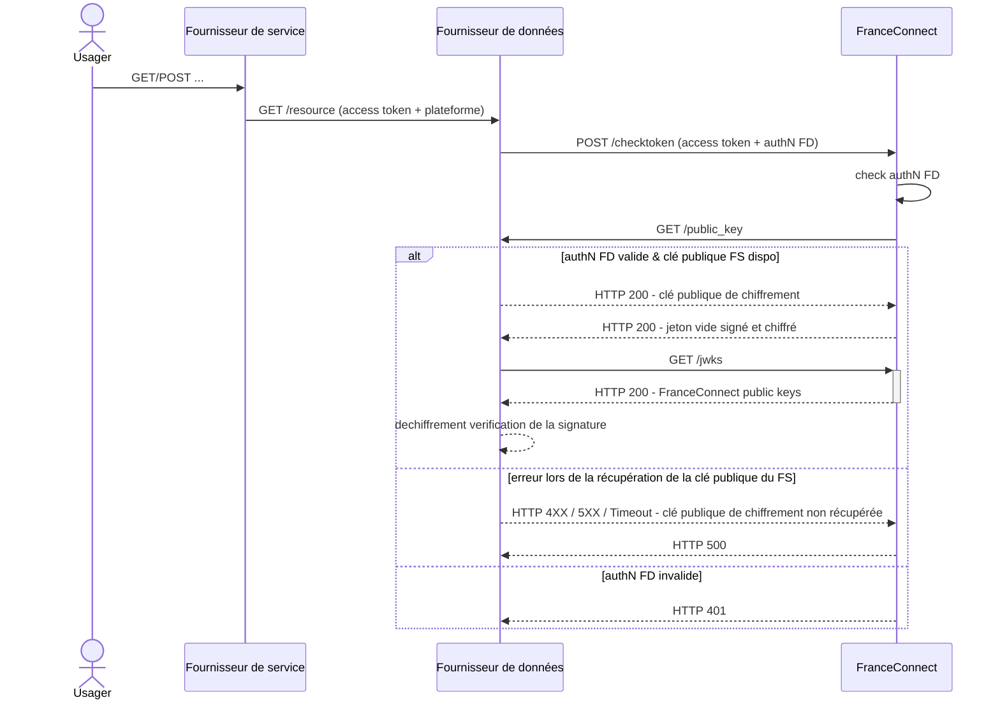

```mermaid

sequenceDiagram

    actor U as Usager
    participant FS as Fournisseur de service
    participant FD as Fournisseur de données
    participant FC as FranceConnect


     U->>FS: GET/POST ...

    FS->>FD: GET /resource (access token + plateforme)

    FD->>FC : POST /checktoken (access token + authN FD)
    FC->>FC: check authN FD

    FC->>FD : GET /public_key

    alt  authN FD valide & clé publique FS dispo

        FD-->>FC : HTTP 200 - clé publique de chiffrement

        FC-->>FD : HTTP 200 - jeton vide signé et chiffré

        FD->>+FC: GET /jwks
        FC-->>-FD: HTTP 200 - FranceConnect public keys
        FD-->>FD : dechiffrement verification de la signature


   else  erreur lors de la récupération de la clé publique du FS

       FD-->>FC : HTTP 4XX / 5XX / Timeout - clé publique de chiffrement non récupérée
       FC-->>FD : HTTP 500


   else authN FD invalide

      FC-->>FD : HTTP 401

    end


```
